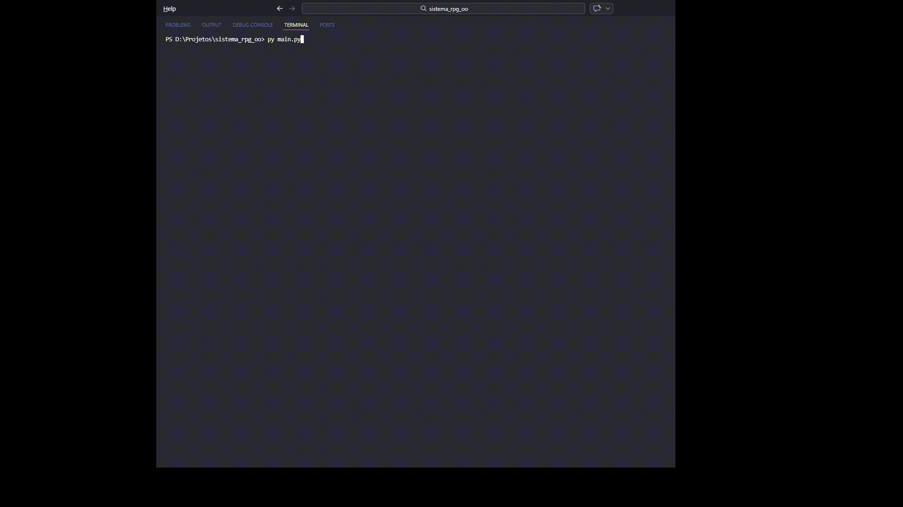

# ⚔️ RPG de Turno - Python POO

Este é um sistema de batalha de RPG baseado em turnos, desenvolvido para consolidar meus estudos em **Programação Orientada a Objetos (POO)** com Python. O projeto simula o combate entre dois personagens, levando em conta atributos como velocidade para determinar a ordem de ataque.

## 🚀 O que o projeto faz atualmente?
* **Sistema de Personagens:** Criação de heróis com atributos de nome, vida, força e velocidade.
* **Gerenciamento de Atributos:** Uso de `@property` para encapsulamento.
* **Lógica de Combate:** Sistema que decide quem ataca primeiro (com fator de desempate aleatório para velocidades iguais).
* **Interface via Console:** Logs detalhados de cada turno e do dano causado.

## 🛠️ Tecnologias Utilizadas
* **Python 3.x**
* **Módulos Nativos:** `time` (para intervalos entre turnos) e `random` (para sorteio de iniciativa).

---

## 🏗️ Futuras Implementações (Roadmap)
Como este projeto faz parte do meu aprendizado contínuo, pretendo adicionar as seguintes funcionalidades em breve:

### 🛡️ Equipamentos e Status
- [ ] **Sistema de Armas:** Cada arma adicionará bônus de ataque ou efeitos especiais.
- [ ] **Armaduras:** Implementação do atributo de **Defesa** para reduzir o dano recebido.
- [ ] **Novos Status:** Adição de **Crítico** (baseado em sorte) e **Esquiva** (baseada em agilidade).

### 🧙 Diversidade de Classes
- [ ] Criar subclasses como `Guerreiro`, `Mago` e `Arqueiro` usando **Herança**.
- [ ] Habilidades especiais únicas para cada classe.

### 🕹️ Experiência do Usuário
- [ ] **Menu Interativo:** Um menu inicial para criar personagens e configurar a batalha sem mexer no código.
- [ ] **Sistema de Nível:** Ganho de experiência (XP) após as vitórias.

---

## ✒️ Autor
**Matheus Goveia**

  
  

---
> "O aprendizado é o único investimento que nunca perde o valor."
